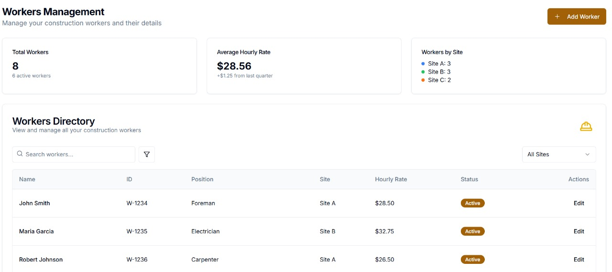
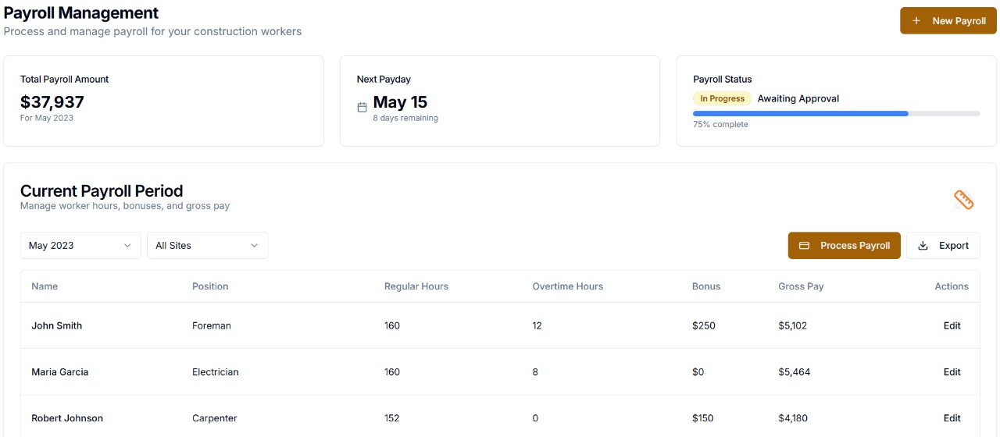
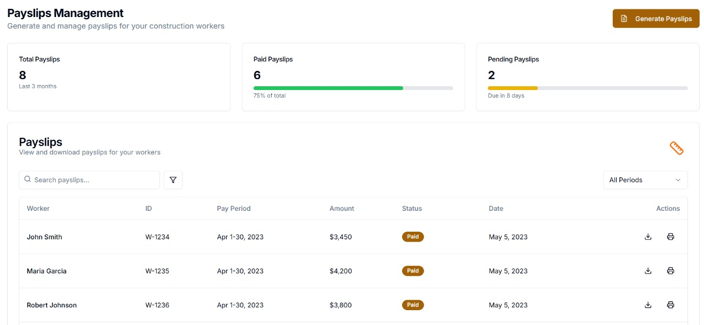
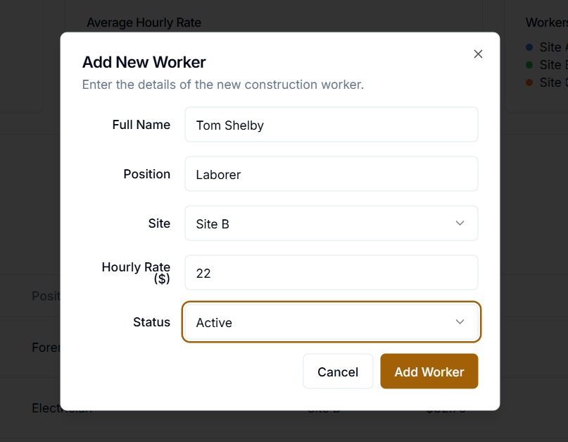
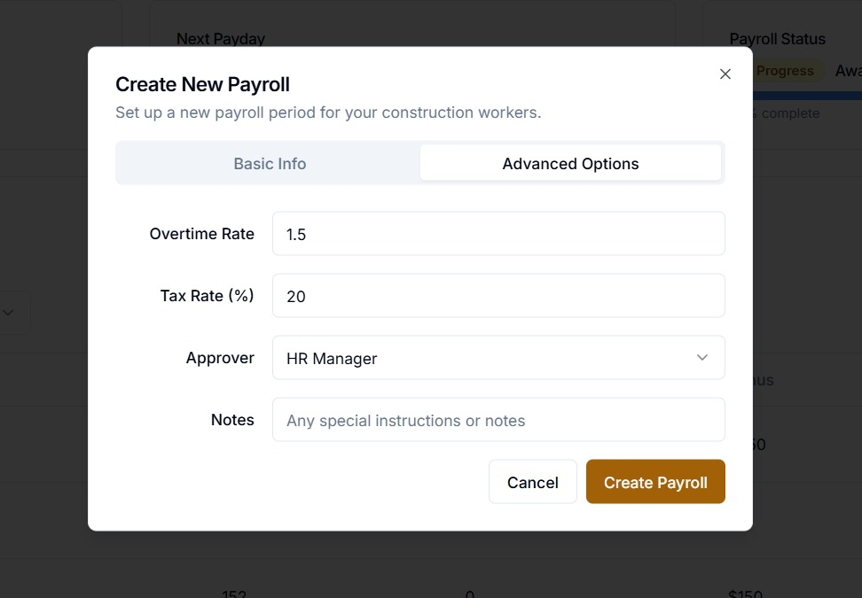

# PayBuilder: Construction Payroll Made Simple

## Overview

**PayBuilder** is a simple yet powerful construction payroll solution designed to streamline payroll processing for building contractors. With a clean and user-friendly interface, PayBuilder allows you to easily manage and automate employee compensation, including hourly rates, bonuses, and deductions.

This repository contains the frontend code for **PayBuilder**, built with **React** and **TailwindCSS**.

---

## Features

- **Payroll Management**: Easily manage and calculate employee salaries based on working hours, bonuses, and deductions.
- **Real-Time Updates**: Dynamic payroll updates and real-time salary calculations.
- **Payslip Generation**: Automatically generate downloadable payslips for workers.
- **Role-based Access**: Different user roles (Admin, HR, Worker) with customizable access rights.

---

## Screenshots

### Dashboard Overview


### Worker Management


### Payroll Management


### Payslip Generation


### Add Worker


### Add Payroll


---

## Tech Stack

- **Frontend**: React.js, TailwindCSS
- **Backend**: Node.js, Express (for future backend setup)
- **Database**: MongoDB (for future integration)
- **Authentication**: Firebase Auth / JWT (for secure authentication)

---

## Installation

### Prerequisites

Before starting, ensure that you have the following installed on your machine:

- [Node.js](https://nodejs.org/) (for managing dependencies)
- [npm](https://www.npmjs.com/) or [yarn](https://yarnpkg.com/) (for package management)

### Steps

1. Clone the repository:
   ```bash
   git clone https://github.com/your-username/paybuilder.git
